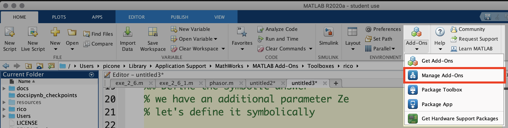
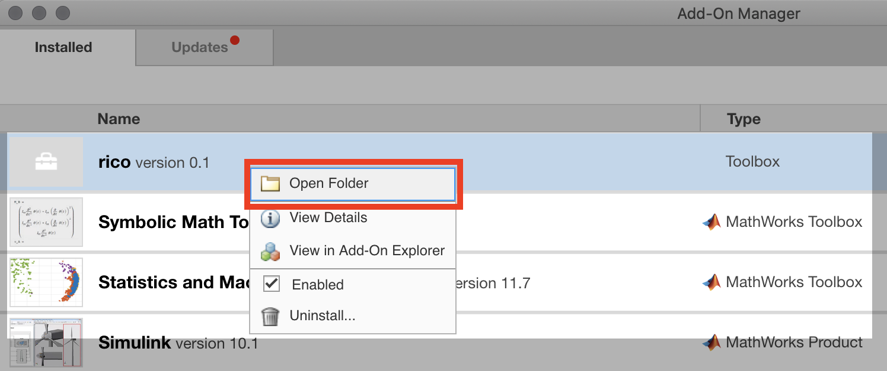
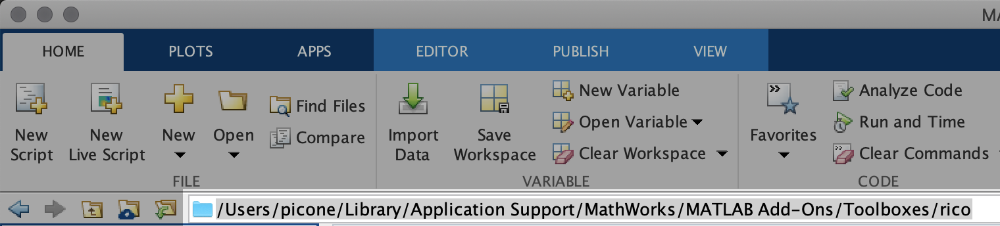

# matlab-rico

Matlab library by Rico Picone, PhD.

## Introduction

I'm using this as my general Matlab utilities repo. Mostly I write Matlab functions for dynamic systems analysis, control systems design, and graphics interaction with LaTeX and tikz.

## Getting started

Download or clone this repo and add the `matlab-rico/rico` directory to your Matlab path as follows.

```matlab
addpath('WHEREVER-YOU-PUT-IT/matlab-rico/rico')
```

Now you should have the `matlab-rico` library functions and classes available.

### Installing it as a Matlab Toolbox

Download the [rico Toolbox file](https://github.com/ricopicone/matlab-rico/raw/master/rico.mltbx) and open it in Matlab (usually a double-click on the file will work). Before it will work, you have to add the installation directory to your Matlab Path. First, open the menu `Home > Add-Ons > Manage Add-Ons`.



Right-click on Toolbox `rico` and select `Open Folder`.



Click the file path `<toolbox path>` in the address bar, selecting it. 



Copy it. Paste it into the following command.

```matlab
addpath(genpath(<toolbox path>))
```

Then lock it in for the future.

```matlab
savepath
```

Sometimes I forget to update the Toolbox, so be warned that it may be out-of-date.

## Docs etc.

The documentation is included in the `docs` directory. Specifically, see `docs.pdf`. The function and class files are in the `rico` directory and some of them include their own documentation, which can be accessed using `help` or `doc` as usual. For instance, we can see the included class documentation for the `phasor` class as follows.

```matlab
help phasor
```